# RECOMMENDER SYSTEM PROJECT
Final project for the 2022-2023 Postgraduate course on Artificial Intelligence with Deep Learning, UPC School, authored by **[Antonio Sánchez](https://www.linkedin.com/in/antonio-s%C3%A1nchez-hern%C3%A1ndez/)**, **[Brenda Fernández](https://www.linkedin.com/in/brenda-fernandez-alayo/)**, **[Evaristo Broullon](https://www.linkedin.com/in/evaristobroullon/)** and **[Joan Dayas](https://www.linkedin.com/in/joansiam/)**. 

Advised by **Paula Gómez Duran**.

Table of Contents
=================

- [RECOMMENDER SYSTEM PROJECT](#recommender-system-project)
- [Table of Contents](#table-of-contents)
	- [1. INTRODUCTION AND MOTIVATION](#1-introduction-and-motivation)
	- [2. OBJECTIVES](#2-objectives)
	- [3. STATE OF ART](#3-state-of-art)
	- [4. IMPLEMENTATION](#4-implementation)
		- [4.1 DATASETS](#41-datasets)
		- [4.2 MODELS](#42-models)
			- [Factorization Machine](#factorization-machine)
			- [Neural Collaborative Filtering](#neural-collaborative-filtering)
			- [Popularity Based](#popularity-based)
			- [Random](#random)
		- [4.3 METRICS](#43-metrics)
		- [4.4 PIPELINE](#44-pipeline)
	- [5. EXECUTION PROCEDURE](#5-execution-procedure)
	- [6. ABLATION STUDY](#6-ablation-study)
		- [6.1 EXPERIMENT A](#61-experiment-a)
		- [6.2 EXPERIMENT B](#62-experiment-b)
		- [6.3 EXPERIMENT C](#63-experiment-c)
		- [6.4 EXPERIMENT D](#64-experiment-d)
	- [7. FINAL RESULTS](#7-final-results)
	- [8. CONCLUSIONS](#8-conclusions)

---


## 1. INTRODUCTION AND MOTIVATION

<div align="justify">

The advancement of artificial intelligence and machine learning technologies has brought intelligent products that are essential in providing access to various endeavors of peoples’ day-to-day life. Effective and useful informationfrom massive internet data could be obtained from intelligent recommendation function of personalized recommender systems thereby making it applicable in sundry network platforms which include, movies, music as well as shop-ping platform.


It is worth noting several sectors that have suffered a greater impact: social networks are conditioned by the user's interest in publications, online commerce has the purpose of showing products that satisfy the user's needs and finally the marketing sector that with information of their clients to define the most optimal marketing action.

In general, recommender systems are algorithms based on suggesting relevant items to users.

Among the various reasons why this field is interesting to study, we found that improving the user experience encourages them to discover new products of interest. In addition, in case the recommendations are accurate, the commitment with the application is strengthened and this causes a win-win since the company captures data to improve its marketing strategies.
</div>

<br />
<br />

## 2. OBJECTIVES
<div align="justify">

In middle of such a variety of actual options in the market for recommender systems, the different problems, complexity and techniques used for data sampling for example, our ambition with this project is to know and understand the advantages of the main different models used today by the industry, sampling techniques and metrics to evaluate the end results of each model tested.

Due to the maturity of the existent technology, vastly used nowadays, our anchor to understand this type of system will be the FM - Factorization Machina model and then extending our exploration to other models like Random, Popularity and the NCF - Neural Collaborative Filtering. Besides using the Amazon products dataset, we have the opportunity to integrate a second dataset to our algorithm, being able to choose between one or another for each execution. The MovieLens dataset, which is largely used and tested in the market and have the same structure (User, Items, Ratings and Timestamp), facilitating the comprehension to consolidate our final results.

From the beginning, we could notice and understand the complexity of recommending something to a customer. There are a lot of variables involved, from the personal taste and style to a general country culture. We understand the importance of using all those context content to recognize the personal taste of a customer, but with it, we come across with a very big complexity introducing those variables in our project. Not only by the scarcity of data resources from the datasets available, but also by time to work with a context based recommender system. This is the main reason we are going to explore the “implicit feedback”, considering as positive an interaction of the customer with a product. For the negative interactions, we will need to generate it using a “negative sampling” technique commonly used by this industry.

In a first superficial look, a recommender system can demonstrate help customers to get close with the products of their interest, but also can help companies to get users more engaged with their brand. On the other hand, instead of adopting a user-centered approach focusing on preference prediction, they shape user preferences and guide choices. This impact is significant and deserves ethical attention.
</div>


<br />
<br />

## 3. STATE OF ART

**COLLABORATIVE RECOMMENDATION SYSTEM**
<div align="justify">

Recommender Systems (RS) are powerful tools to address the information overload problem in the Internet. They make use of diverse sources of information. Explicit votes from users to items, and implicit interactions are the basis of the Collaborative Filtering (CF) RS. According to the type of data being collected and the ways of using them in recommendation systems, the approaches for recommendation can be classified as content-based (CB), collaborative filtering (CF) and hybrid one (Koren, Bell, & Volinsky, 2009).

Implicit interactions examples are clicks, listened songs, watched movies, likes, dislikes, etc. Often, hybrid RS are designed to ensemble CF with some other types of information filtering: demographic, context-aware, content-based, social information, etc. RS cover a wide range of recommendation targets, such as travels, movies, restaurants, fashion, news, etc.

There are two kinds of collaborative filtering algorithms: user-based and item-based. User-based collaborative filtering algorithm is to recommend the items which similar users have liked while item-based one is to recommend similar items according to users’ past behaviour. Because internet products usually have much larger user number than item number, they prefer to use the item-based collaboration to the user-bases one in their recommendation system considering the computation complexity. 

CB filtering is widely used for recommendation systems design, which utilizes the content of items to create features and attributes to match user profiles. Items are compared with items previous liked by the users and the best matched items are then recommended. One major issue of CB filtering approach is that RS needs to learn user preferences for some types of items and apply these for other types of items.

</div>


**SAMPLING TECHIQUES**

<div align="justify">

[“Negative Sampling”](https://arxiv.org/pdf/1706.07881.pdf) strategy, in which k negative samples are drawn whenever a positive example is drawn. The negative samples are sampled based on the positive ones by replacing the items in the positive samples. 

**FULL RANKING**
To rank a set of recommender models, we rank a target set of items for every sequence in the test set using each model. We calculate the metrics on the ranked items and then average the values for each model and rank the models using the mean. In this paper we investigate three different strategies to create the target set of items and name the ranking according to the used method to extract the target set for calculating the metrics: The one we are going to focus is the full ranking we calculate the metrics on the target set that is equal to the [full item set](https://arxiv.org/pdf/2107.13045.pdf).
</div>


<!-- ### HYPERPARAMETER TUNING
#### FACTORIZATION MACHINE
#### NEURAL COLLABORATIVE FILTERING -->

<br />
<br />

## 4. IMPLEMENTATION
### 4.1 DATASETS
**Amazon Musical Instruments**

<div align="justify">

[This dataset](https://nijianmo.github.io/amazon/index.html) is part from an updated version of the Amazon review dataset released in 2014. As in the previous version, this dataset includes reviews (ratings, text, helpfulness votes), product metadata (descriptions, category information, price, brand, and image features), and links (also viewed/also bought graphs).
We use the reduced dataset that includes no metadata or reviews but only (item, user, rating, timestamp) tuples.
This dataset provides the following features:
  * The total number of clients is **903330**
  * The total number of products is **112222**
  * The total number of ratings is **1512530**

</div>


**MovieLens**

<div align="justify">

The [MovieLens](https://files.grouplens.org/datasets/movielens/ml-100k.zip) datasets, first released in 1998, describe people’s expressed preferences for movies. These preferences take the form of tuples, each the result of a person expressing a preference (a 0-5 star rating) for a movie at a particular time. These preferences were entered by way of the MovieLens web site1 — a recommender system that asks its users to give movie ratings in order to receive personalized movie recommendations.
We use the MovieLens-100K Dataset containing 100.000 anonymous ratings with:
- **userID** in range between 1 and 943
- **movieID** in range between 1 and 1682
- **rating** that are made in a 5-star scale
- **timestamp** representing time in seconds since de rating was done
- Each user has **at least 20 ratings**
 

**Data preparation**
Cleaning and transforming data is absolutely necessary for reliable results.
We include a script that may be used  to set up the datasets that:
* Reformat data types
* Remove duplicates
* Reduce size of dataset by parametrization of a minimum rating value per item and user

In order to reduce computational requirements we created three different datasets:
* MovieLens dataset with each user having at least 20 rating, 100000 ratings of 943 users and 1682 items.
* Amazon Instruments with each user having at least 8 ratings and each item rated by also at least 8 user s, with a result of 52.023 ratings of 4275 users and 2080 items.
* Amazon Instruments with each user having at least 6 ratings and each item rated by also at least 6 user s, with a result of 137.365 ratings of 14138 users and 6178 items.

</div>


### 4.2 MODELS
#### Factorization Machine
<div align="justify">


To start understanding matrix factorization for recommender systems, we define the following matrices: a rating matrix R which is in general an R ∈ R m×n matrix. Each row of R represents a user and each column represents an item. The values Rui represent the rating (or score) that user u has given to item i. The problem we are trying to solve is as follows: For any collection of users and items, we have the situation where not all users have given ratings to all the items. In fact, if examined the values of R, we would find that several values are incomplete. However, we wish to recommend certain items to users. How do we do that? One way is to simply recommend any item the user has not already rated to them; this could mean sending a message to the user daily with a recommendation for an item. However, we quickly see the issue with this; if we keep recommending items to users that they don’t like, they will very quickly start ignoring our messages. We would lose credibility with the user and they may eventually unsubscribe from our messages.

There are two kinds of rating forms: implicit rating and explicit rating. Take movie recommendation as an
example:
1. Implicit: We only know the historical data whether the user watch the movie or not. The data can be represented as 0 and 1 format that 0 means un-watch and 1 means watch.
2. Explicit: Users explicitly rate all the movie they watch in the past. The data can be represented in discrete range, e.g 1, 2, · · · , 5.

[Factorization Machine](https://arxiv.org/pdf/2203.11026.pdf) (FM) is designed to combine Support Vector Machine (SVM) and MF. It can handle large sparse data and subsumes MF and SVD++. FM does not only use first-order feature linear components but also second-order (cross-product) of the features to capture more potential relationship inside the features.
Suppose we have x as input matrix (rating and other features) and $\hat{y}$ as output. 2-way FM can be written as equation24 which only concerns first-order and second-order feature interactions. An example of the input and output data format as figure.

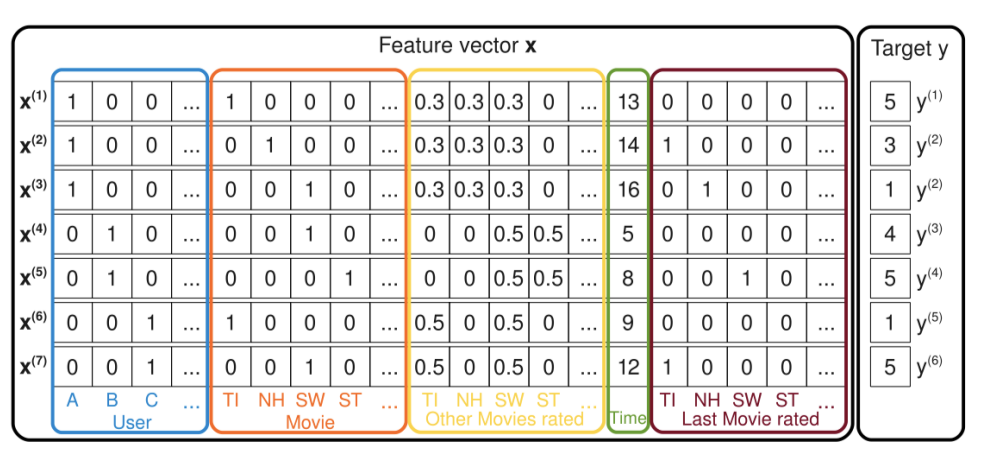
<p align="center"> Example of FM’s input and output data format. </p>


<p align="center">
    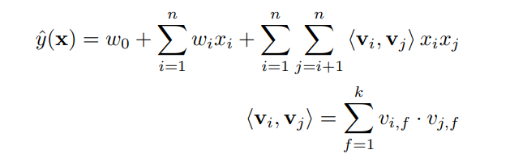
</p>

where we have three parameters: $w_0 ∈ R$, $\mathbf{w} ∈ R^n$, $\mathbf{v}$ $∈ R^{n×k}$ that $w_0$ is the global bias, $w_i$ models the strength of the i-th variable, $\hat{w}_{i,j} :=<\nu_i,\nu_j>$ models the interaction between the ith and j-th variable which idea is similar with FM that can do dimensionality reduction on w. We can prove the computation complexity of equation above is linear.

<p align="center">
    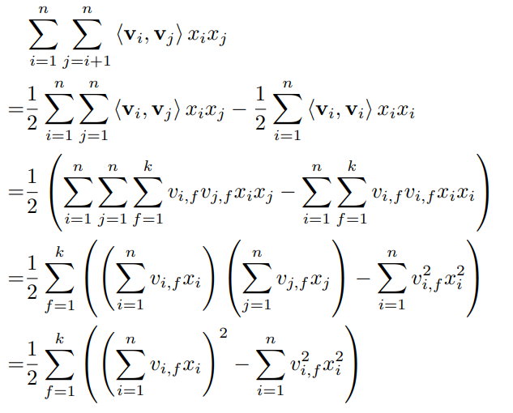
</p>


</div>

#### Neural Collaborative Filtering
<div align="justify">


Among the various collaborative filtering techniques, matrix factorization (MF) is the most popular one, which projects users and items into a shared latent space, using a vector of latent features to represent a user or an item. Thereafter a user’s interaction on an item is modelled as the inner product of their latent vectors.

To handle the absence of negative data, they have either treated all unobserved entries as negative feedback, or sampled negative instances from unobserved entries. For pairwise learning, the idea is that observed entries should be ranked higher than the unobserved ones. As such, instead of minimizing the loss between $\hat{y_{ui}}$ and ${y_{ui}}$, pairwise learning maximizes the margin between observed entry $\hat{y_{ui}}$ and unobserved entry $\hat{y_{uj}}$ .
Moving one step forward, our [NCF](https://arxiv.org/pdf/1708.05031.pdf) framework parameterizes the interaction function f using neural networks to estimate $\hat{y_{ui}}$. As such, it naturally supports both pointwise and pairwise learning.


**General framework**


<p align="center">
    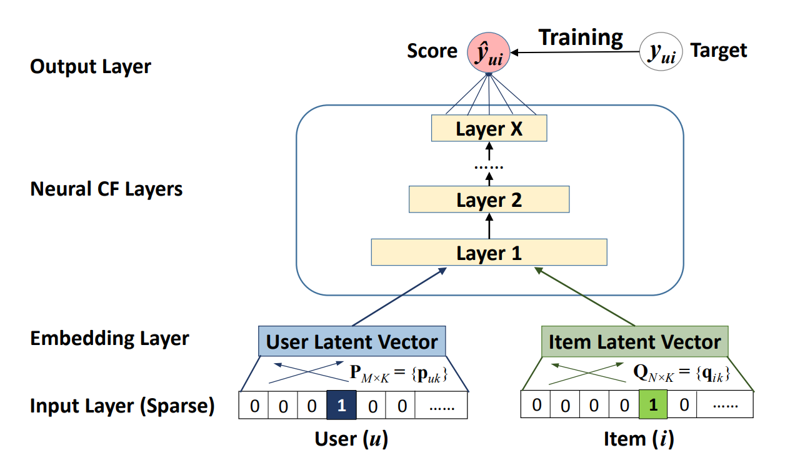
</p>

Above the input layer is the embedding layer; it is a fully connected layer that projects the sparse representation to a dense vector. The obtained user (item) embedding can be seen as the latent vector for user (item) in the context of latent factor model. The user embedding and item embedding are then fed into a multi-layer neural architecture, which we term as neural collaborative filtering layers, to map
the latent vectors to prediction scores. Each layer of the neural CF layers can be customized to discover certain latent structures of user–item interactions. The dimension of the last hidden layer X determines the model’s capability. The final output layer is the predicted score $\hat{y_{ui}}$, and training is performed by minimizing the pointwise loss between $\hat{y_{ui}}$ and its target value ${y_{ui}}$.

**Generalized Matriz Factorization (GMF)**

As MF is the most popular model for recommendation and has been investigated extensively in literature, being able to recover it allows NCF to mimic a large family of factorization models.
Due to the one-hot encoding of user (item) ID of the input layer, the obtained embedding vector can be seen as the latent vector of user (item). Let the user latent vector $\mathbf{p}_u$ be P $\mathbf{P}^T \mathbf{v}^{U}_u$ and item latent vector $\mathbf{q}_i$ be $\mathbf{Q}^T \mathbf{v}^{I}_i$. We define the mapping function of the first neural CF layer as the product of vectors $\mathbf{p}_u$ and $\mathbf{q}_i$.

We then project the vector to the output layer: 

$$\hat{y}_{ui}=a_{out}(\mathbf{h}^T(\mathbf{p}_u · \mathbf{q}_i))$$

where ${a_{out}}$ and $\mathbf{h}$ denote the activation function and edge weights of the output layer, respectively. 


**Multi-Layer Perceptron (MLP)**

we propose to add hidden layers on the concatenated vector, using a standard MLP to learn the interaction between user and item latent features. In this sense, we can endow the model a large level of flexibility and non-linearity to learn the interactions between $\mathbf{p}_u$ and $\mathbf{q}_i$ , rather than the way of GMF that uses only a fixed element-wise product on them. More precisely, the MLP model under our NCF framework is defined as

$$\mathbf{z}_1 = \phi_1(\mathbf{p}_u,\mathbf{q}_i) = {\mathbf{p}_u  \brack \mathbf{q}_i} $$
$$ \phi_2(\mathbf{z}_1) = a_2(\mathbf{W}^{T}_2 \mathbf{z}_1 + \mathbf{b}_2) \\ 
...\\
 \phi_L(\mathbf{z}_{L-1}) = a_L(\mathbf{W}^{T}_L \mathbf{z}_{L-1} + \mathbf{b}_L) $$
$$\hat{y}_{ui}=\sigma(\mathbf{h}^T\phi_L(\mathbf{z}_{L-1}))$$

where $\mathbf{W}_x$, $\mathbf{b}_x$, and ax denote the weight matrix, bias vector, and activation function for the x-th layer’s perceptron, respectively.

**Fusion of GMF and MLP**
<p align="center">
    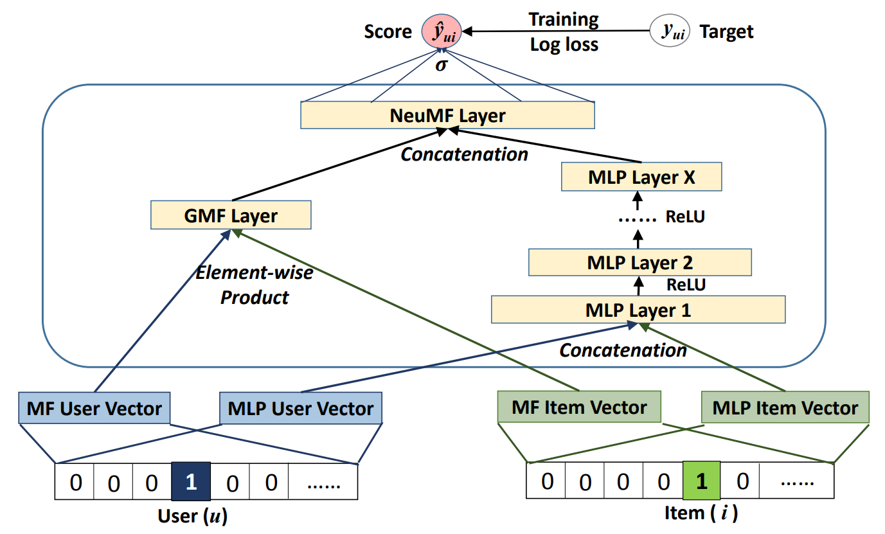
	Neural matrix factorization model
</p>

A straightforward solution is to let GMF and MLP share the same embedding layer, and then combine the outputs of their interaction functions. This way shares a similar spirit with the well-known Neural Tensor Network (NTN).
Specifically, the model for combining GMF with a one-layer MLP can be formulated as 

$$\hat{y}_{ui}=\sigma(\mathbf{h}^T a(\mathbf{p}_u \bigodot \mathbf{q}_i + \mathbf{W} {\mathbf{p}_u  \brack \mathbf{q}_i}  + \mathbf{b}_L) )$$


To provide more flexibility to the fused model, we allow GMF and MLP to learn separate embeddings, and combine the two models by concatenating their last hidden layer.

$$ \phi^{GMF} = \mathbf{p}^G_u \bigodot \mathbf{q}^G_i , \\
\phi^{MLP} = a_L(\mathbf{W}^{T}_L \mathbf{z}_{L-1} + \mathbf{b}_L) , $$
$$\hat{y}_{ui}=\sigma(\mathbf{h}^T {\phi^{GMF}  \brack \phi^{MLP}} ) $$

The formulation where $\mathbf{p}^G_u$ and $\mathbf{q}^G_i$ denote the user embedding for GMF and MLP parts, respectively; and similar notations of $\mathbf{q}^G_i$ and $\mathbf{p}^G_u$ for item embeddings.

</div>

#### Popularity Based
<div align="justify">


The popularity model is a simple statistic model that generates a list of the items ordered by the number of interactions.

It has the advantage of solving the 'cold start' problem when the recommender system has to recommend items to a new user or a user that has no enough recorded interactions history.

Is a very interesting model to include into a comparison between models because allows to check how most popular items are tracted by other models.
</div>

#### Random
<div align="justify">
The Random model generates randomly every recomended list, it has the advantage of a coverage of the 100% of the items catalogue.

It is also interesting to include in a comparison because it must always be the model with worse accuracy results but best coverture.

</div>

### 4.3 METRICS

* **Hit Ratio**: Measures whether the test item is in the top@K positions of the recommendation list.
* **NDCG (Normalized Discounted Cumulative Gain)**: Measures the ranking quality which gives information about where in the raking is our test item. 
* **Coverage**: Coverage is the percent of items in the training data the model is able to recommend on a test set.


### 4.4 PIPELINE

To be able to accomplish our goal and process all those different datasets, train and test the different models, in the diagram below we can have an idea the structure of the program and the necessary parametrization: 


<p align="center">
	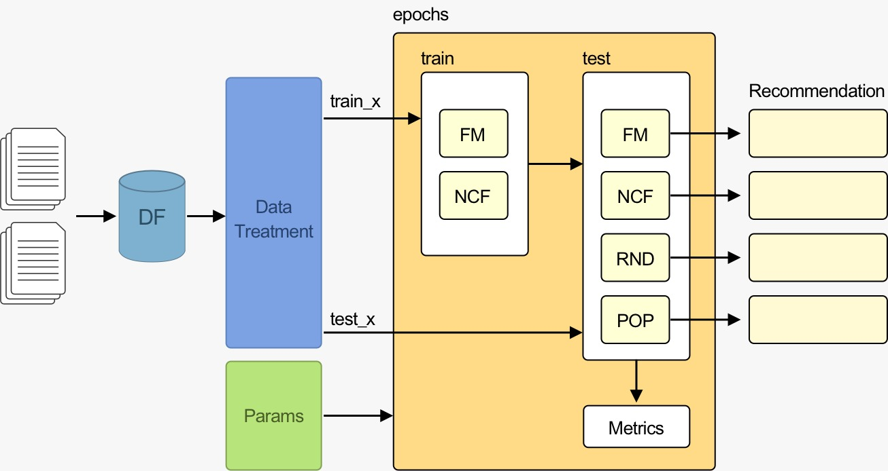<br />
</p>


<br />
<br />

## 5. EXECUTION PROCEDURE
<div align="justify">

To get started with the development process for this Deep learning-based recommender system, you'll need to follow the steps outlined below:

**Clone the repository**
```
>> git clone "https://github.com/antoniosh97/Recommender-System-2023.git"
```
<br />

**Activate the environment**
To begin, you'll need to activate the project's environment. This can be achieved by running the following commands in the terminal:
```
>> conda create --name final-project python=3.8 
>> conda activate final-project 
>> pip install -r requirements.txt 
```
These commands will create a new environment called "final-project" with Python version 3.8 and install all the required packages listed in the "requirements.txt" file.
<br />

**Set the variables in the __init__ function of the Main class**

>> Code can be found in: **/Implementation** folder


* **dataset**: the name of the dataset to use. Set it to "Amazon" or "movie lens".
* **device**: the device to use for training. Set it to torch.device('cuda') to use the GPU, or torch.device('cpu') to use the CPU. (automatically tries to use CUDA if available)
* **test_mode**: set it to True to use a smaller dataset for testing purposes.
* **show_tb**: set it to True to enable Tensorboard.
* **tuning_mode**: set it to True to perform hyperparameter tuning. Set it to False to use the default hyperparameters.
* **tuning_params**: set the hyperparameters to use for hyperparameter tuning.
* **num_neg**: the number of negative samples to use.
* **leave_one_out**: the leave-one-out strategy to use. Set it to "TLOO" or "RLOO".
* **topk**: the number of recommendations to return.
* **num_epochs**: the number of epochs to train for.
* **batch_size**: the batch size to use for training.
* **hidden_size**: the size of the hidden layer in the FM and NCF models.
* **lr**: the learning rate to use for training.
* **hidden_size_ncf**: the size of the hidden layer in the NCF model.
* **lr_ncf**: the learning rate to use for training the NCF model.
* **seed**: the seed to use for random reproducibility.<br /><br />

**Run the main module**
This will execute a pipeline that includes the following steps:
- Initializing the parameters and settings for the pipeline, such as the dataset to be used, the device to run the code on (GPU or CPU), and the hyperparameters to tune the models.
- Reading and preprocessing the dataset using the dataset module.
- Splitting the data into training and testing sets using the exec module.
- Defining the models to be trained and evaluated: model_fm, model_random, model_pop, model_nfc.
- Training and evaluating each model using the exec module.
- Generating evaluation plots using the plots module.
- Logging the results of each model and experiment using the logs module.
In summary, the pipeline takes in a dataset, trains and evaluates multiple recommendation models on it, and generates plots and logs to summarize the results. The pipeline is configurable, allowing for the exploration of different hyperparameters and datasets.
</div>

<br />
<br />

## 6. ABLATION STUDY
<div align="justify">

We have considered changing the number of negatives per positive because in *negative sampling* it usually has values between four and six. Regarding the number of epochs, we stay with twelve because we have noticed that even if increasing it improves coverage, it starts decreasing with time.

The topk has not been changed because based on the real world, companies are not usually interested in recommending more than 10 items.

In order to modify the results of the models, we have tested with thirty-two and sixty-four hidden neurons, but we have discarded lower one for worsen the numbers.

As a note, the learning rate has been increased by a factor of 10 since despite having the Adam optimizer, the experiments can vary.
</div>

### 6.1 EXPERIMENT A
**Experiment setup**
* Number of negatives per positive: $\mathbf{5}$
* Number of hidden neurons: $\mathbf{64}$
* Learning rate for MF and NCF: $\mathbf{1·10^{-4}}$

**Results**

| Model | HR@10      | NDCG@10    | %Coverage@10 |
| :------  | :------:|   :------:|   :------: |
| FM    |     0.0487 |     0.0304 |      15.5769 |
| RND   |     0.0049 |     0.0022 |     100.0000 |
| POP   |     0.0356 |     0.0129 |       0.4808 |
| NCF   |     0.0709 |     0.0433 |      16.9712 |

**Conclusions**

<div align="justify">

With this experiment, comparing our models, given the current tuning parameters, it's possible to conclude the NCF model have a better performance in the end of the last epoch. With more presence of our test item in the topk 10 predicted values observed by the metric Hit Ratio. The ranking quality of our test item comparing inside the predicted values is close to the FM, but a difference 0,0129% better, observable by the NDCG metric. On the other hand, the total coverage of items in test set comparing with the training set was quite similar to the Factorization Machine model, with a positive advantage of 1,3943%.

</div>

### 6.2 EXPERIMENT B
**Experiment setup**
* Number of negatives per positive: $\mathbf{5}$
* Number of hidden neurons: $\mathbf{64}$
* Learning rate for MF and NCF: $\mathbf{1·10^{-3}}$

**Results**

| Model | HR@10      | NDCG@10    | %Coverage@10 |
| :------  | :------:|   :------:|   :------: |
| FM    |     0.0606 |     0.0354 |      49.6635 |
| RND   |     0.0049 |     0.0022 |     100.0000 |
| POP   |     0.0356 |     0.0129 |       0.4808 |
| NCF   |     0.0515 |     0.0275 |      68.5096 |

**Conclusions**
<div align="justify">

Based on the results of this experiment, given the current tuning parameters, we can see in this case changing our learning rate, the best result was obtained by the model FM. With more presence of our test item in the topk 10 predicted values observed by the metric Hit Ratio and the ranking quality of our test item comparing inside the predicted values is close to the NCF, with a difference of 0,0079% better, observable by the NDCG metric. In contradiction, it's posible to see somehow, the total coverage of items in test set comparing with the training set for the Factorization Machine model was lower than NCF, with a negative difference of 18,8461%.

</div>


### 6.3 EXPERIMENT C
**Experiment setup**
* Number of negatives per positive: $\mathbf{6}$
* Number of hidden neurons: $\mathbf{64}$
* Learning rate for MF and NCF: $\mathbf{1·10^{-4}}$


**Results**

| Model | HR@10      | NDCG@10    | %Coverage@10 |
| :------  | :------:|   :------:|   :------: |
| FM    |     0.0475 |     0.0303 |      10.7692 |
| RND   |     0.0049 |     0.0022 |     100.0000 |
| POP   |     0.0356 |     0.0129 |       0.4808 |
| NCF   |     0.0699 |     0.0432 |      17.5481 |

**Conclusions**

<div align="justify">

Given the current tuning parameters for this experiment, is easly to see the a good performance of NCF model compared with FM. With more presence of our test item in the topk 10 predicted values observed by the metric Hit Ratio, but just a small difference of 0,0129 for the ranking quality observable by the NDCG metric. Even if with a predominant better result for the coverage for the NCF compared with FM, both models generated low percentage rates.
</div>

### 6.4 EXPERIMENT D
**Experiment setup**
* Number of negatives per positive: $\mathbf{6}$
* Number of hidden neurons: $\mathbf{64}$
* Learning rate for MF and NCF: $\mathbf{1·10^{-3}}$

**Results**
| Model | HR@10      | NDCG@10    | %Coverage@10 |
| :------  | :------:|   :------:|   :------: |  
| FM    |     0.0639 |     0.0360 |      43.7500 |
| RND   |     0.0049 |     0.0022 |     100.0000 |
| POP   |     0.0356 |     0.0129 |       0.4808 |
| NCF   |     0.0536 |     0.0274 |      67.8846 |

**Conclusions**
<div align="justify">

For this experiment, based on the tuning parameters, it is not difficult to observe a small difference in our end results. Even so, FM achieved more presence of our test item in the topk 10 predicted values observed by the metric Hit Ratio compared with NCF and we can notice the same behavior for the ranking quality of our test item comparing inside the predicted values. Otherwise, even if FM reached a better position for the previous rates, the coverage in contradiction was much more favorable to NCF.
</div>


<br />
<br />

## 7. FINAL RESULTS

<div align="justify">

The above experiments show that the best combination is when the Factorization Machine (FM) model has a learning rate of ${1·10^{-3}}$ and $l_r ={ 1·10^{-4}}$ for the Neural Collaborative Filtering (NCF) model. Can be seen that both 6 negatives for positive and 5 are quite similar, so we decided to implement everything with 5.
The final configuration looks like this:
* Number of negatives per positive: $\mathbf{5}$
* Number of hidden neurons: $\mathbf{64}$
* MF Learning rate: $\mathbf{1·10^{-3}}$
* NCF Learning rate: $\mathbf{1·10^{-4}}$


**Dataset with a minimium of 8 reviews per user and 8 users per item**

As already mentioned, the models are fitted with the optimal parameters and run with the smallest dataset.

The following table shows that the Hit Ratio values are as high as possible in both FM and NCF besides their coverages have a decent value.


| Model | HR@10      | NDCG@10    | %Coverage@10 |
| :------  | :------:|   :------:|   :------: |  
| FM    |     0.0606 |     0.0354 |      49.6635 |
| RND   |     0.0049 |     0.0022 |     100.0000 |
| POP   |     0.0356 |     0.0129 |       0.4808 |
| NCF   |     0.0709 |     0.0433 |      16.9712 |


The following graphs show that neither of the two models generates bias, since their figure resembles the train data.
<p align="center">
	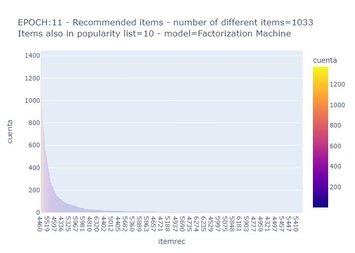
	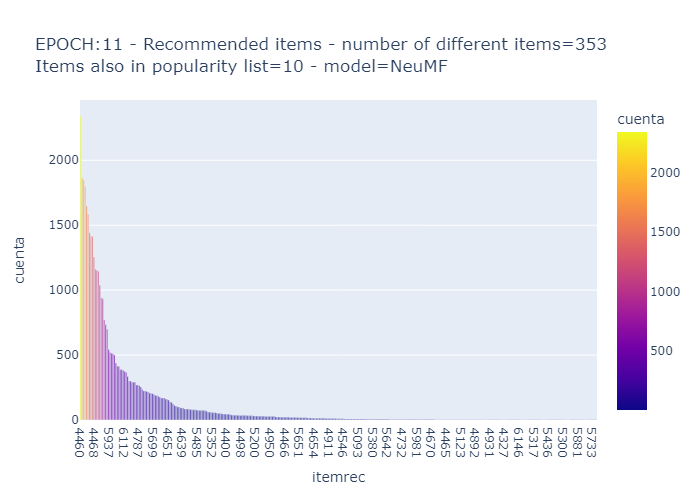
	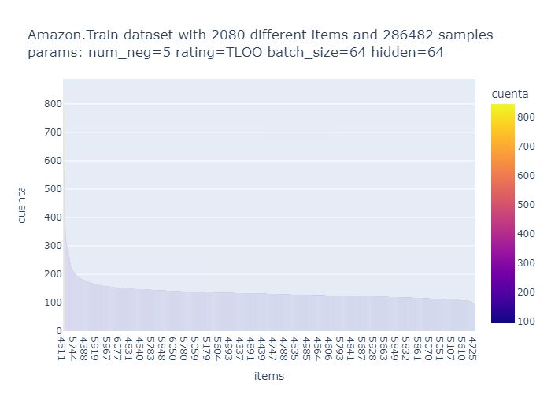
</p>


**Dataset with a minimium of 6 reviews per user and 6 users per item**

To present a single result, we take the measurements above as a reference and run everything with the final dataset.

The following table shows that the initial hypothesis in which the NCF model gives better results than the FM is fulfilled.

| Model | HR@10      | NDCG@10    | %Coverage@10 |
| :------  | :------:|   :------:|   :------: |  
| FM    |     0.0431 |     0.0268 |      16.4616 |
| RND   |     0.0019 |     0.0010 |     100.0000 |
| POP   |     0.0266 |     0.0098 |       0.1619 |
| NCF   |     0.0470 |     0.0290 |      31.8064 |


The following graphs show that neither of the two models generates bias, since their figure resembles the train data besides, the number of  unique items in NCF is greater.
<p align="center">
	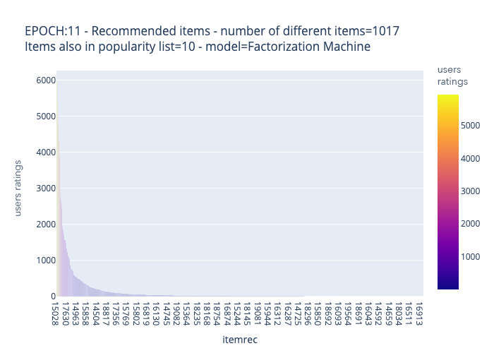
	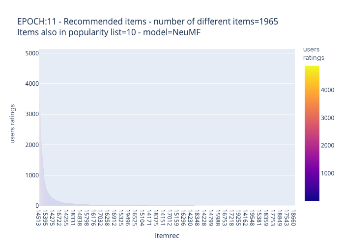
	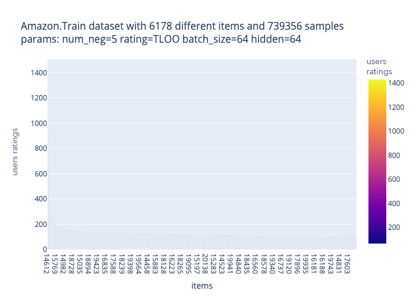
</p>

</div>


<br />
<br />


## 8. CONCLUSIONS
<div align="justify">

As we have been able to verify, when comparing different models using the Amazon dataset, Neural Collaborative Filtering has been the winning model, since it has undoubtedly improved the Hit Ratio and NDCG metrics of the Factorization Machine, but has doubled your coverage.

After analyzing the final test, we can deduce several key points that have a great impact on the understanding of a recommender system. The importance of the coverage value, since good metrics can be compatible with low coverage and must be taken into account. On the other hand, there must be a trade-off, this can be seen in the Random model where with a convergence of one hundred percent we have very low results, since it does not learn from user preferences. On the other hand, the Popularity-Based model would be a great candidate to recommend items to a new user, a phenomenon also called "cold start". We have seen that if we decrease the epochs, the results increase considerably, such as using lower lr, using top@k of 20 items, or not choosing the most modern interaction in the full rating test.

Finally, comment that recommendation systems may tend be restricted by the compliance of the business, whether due to legal, social or political issues, and for this reason it is necessary to study and know as much as possible about the bias generated by our models .<br/><br/>

**Next steps**

In conclusion of the project, the numbers generated give us evidence of optimist results, leaving some topics open due to the interest in the subject that could improve the quality in general terms. 

Pursuing our main goal to improve the user experience and make them engage with the content, using context variables to measure the behaviour of the user as explicit feedback should be a very important next step for this project. Regrettably, as already mentioned, as long as we enter in the domain of the recommender systems, we could understand the complexity of recommending something to a customer at this level, which makes us follow the way of using the implicit feedback. The calculations have been made taking into account the following tags: userID, itemID and timestamp, so several parameters have been left unanalysed. The rating has an important role, which we could have used as explicit feedback, the only drawback would be that if our matrix was already sparse enough, with this context we add more zeros. As well as, rating could have focused on defining the behavior of the user, since, if the user tends to score low, we would have this situation present and controlled together with the BIAS of the average score of the item. The analysis of the history of the items saved in the basket, favorites and deleted from the basket would be something interesting to take into account because that would generate a BIAS per user. The product category could have been added since the user may be interested in a specific area, such as string instruments. It must be emphasized that there are companies whose interests are to set a bias in the model, this is how certain products are shown to you either by marketing strategies or advertising agreements, but this could enter in conflict with the ethical side of using a recommender system and the data privacy area. 

One of our consensus point is the possibility to “bring to life” and see the system in action to visualize the interested party to interact with the system, creating an application that would allow us to choose a user and it would show their top 10 recommendations with the highlighted ground truth. <br/><br/>

**Ethical**

As far as we get deep in the ethical point applied to recommender system, we could notice this is a topic worthy to have a entire project dedicated to it just considering the different aspects envolved and the importance of it for the user, the society or even for the country.

The human being is a creature with preferences that can be a continuous variable, the complexity of implementing systems to monitor and collect those variables are extensive. This information once collected will provide data for the recommender systems. But apart from the technical side, the interests guided behind the code lines mould the nature of the system and show the limits of the ethical side of each company. It's not difficult to imagine inside the big advertisement industry, with sponsored products, brands, stores, ads and videos, the importance of the extreme care when configuring the recommender system to avoid influence in user's choice.

Recommend a product to a customer require knowledge about this person's preferences, the security issues about user data will be a very big point for discussion in data privacy area, problems that should be mitigated or avoid.

We can ask ourselves until each level companies should know about their clients?

In the end, our point of view about the ethical dilemma in recommender systems, companies should play fair with users, cover all the security issues, always be transparent with clients about the user data usage and really try to build a system to solve the user's pain, giving them support and recommending products accordingly with their interests.
</div>


